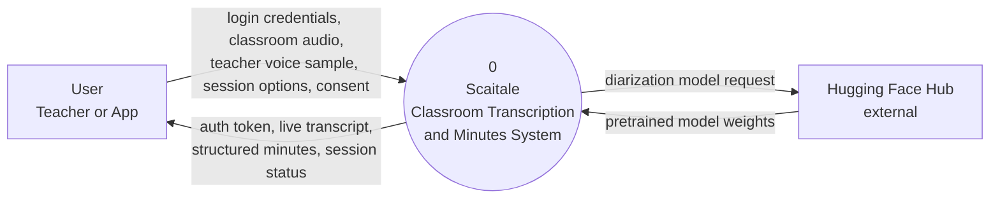
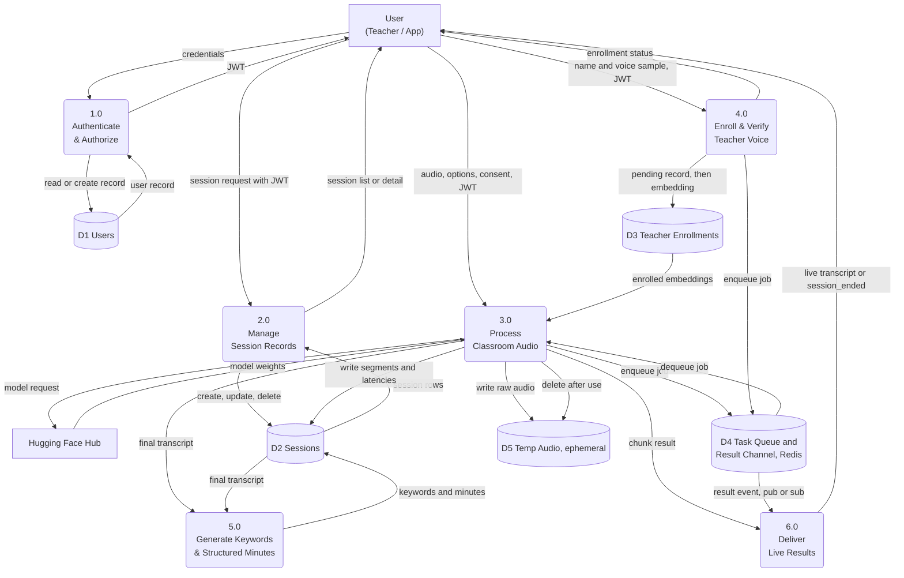

# Data Flow Diagrams — Scaitale

Level 0 (context) and Level 1 (major processes) DFDs for the backend as
actually built (`backend/`), not an aspirational design — every process
and data store below maps to real code, referenced by file path. The
Flutter client (`android/`) doesn't exist yet; **User** below is the
intended client boundary, exercised today via `scripts/v2_smoke_test.py`
/ `scripts/ws_smoke_test.py` and FastAPI's `/docs` UI.

**Not the same diagram as the manuscript's Figure 2/Figure 3.** The
thesis's own Context Diagram and Level 1 DFD (Chapter 3, Requirement
Analysis) are a *conceptual* diagram naming three external entities —
Teacher, Student, Researcher/System Administrator. This file is an
*implementation* diagram of the single-role backend that actually
exists today (one `User`/JWT account type, no role field). Both are
intentionally kept, at different levels of abstraction — see
`docs/paper-vs-implementation.md` for the entity mapping and why the
backend's single-role model isn't a gap against the manuscript's
functional requirements.

**Notation:** rectangle = external entity, rounded box = process,
cylinder = data store, labeled arrow = data flow.

---

## Level 0 — Context Diagram

The system as one process. Everything inside the boundary (auth,
pipeline, minutes generation, storage) is invisible from here — that's
what Level 1 opens up.

| # | From → To | Data |
|---|---|---|
| 1 | User → System | Login/register credentials |
| 2 | User → System | Classroom audio — whole file (`POST /transcribe`) or live chunks (`WS /ws/transcribe`) |
| 3 | User → System | Teacher voice enrollment sample + name |
| 4 | User → System | Session title, `consent_confirmed`, pipeline toggles (denoise/VAD/diarization/teacher-verification) |
| 5 | System → User | JWT access token |
| 6 | System → User | Live transcript segments, session status, structured minutes, exported minutes file, enrollment status |
| 7 | System → Hugging Face Hub | Gated model download request (only when `enable_diarization` + `HF_TOKEN` set) |
| 8 | Hugging Face Hub → System | `pyannote/speaker-diarization-community-1` model weights |

The Hugging Face flow is the only outbound dependency the system has on
another live service — everything else (Whisper, Silero VAD, SpeechBrain)
runs from locally-cached weights once downloaded.

---

## Level 1 — Major Processes

| # | From → To | Data | Code |
|---|---|---|---|
| 1 | User → 1.0 | Email + password | `backend/api/auth.py` |
| 2 | 1.0 ↔ D1 Users | Verify hash / create account | `backend/services/user_service.py` |
| 3 | 1.0 → User | Signed JWT | `backend/core/security.py: create_access_token()` |
| 4 | User → 2.0 | Create / list / get / delete session | `backend/api/sessions.py` |
| 5 | 2.0 ↔ D2 Sessions | Session CRUD, owner-scoped | `backend/services/session_service.py` |
| 6 | User → 3.0 | Audio (file or WS chunk) + toggles + `consent_confirmed` | `backend/api/transcribe.py` |
| 7 | 3.0 → D5 Temp Audio | Raw bytes written to a temp file | `backend/utils/audio_io.py: write_temp_audio()` |
| 8 | 3.0 → D4 Task Queue | Enqueued transcription job | `backend/worker/tasks.py: transcribe_file_task` / `transcribe_chunk_task` |
| 9 | D4 → 3.0 (worker) | Dequeued job picked up by a worker process | `backend/worker/celery_app.py` |
| 10 | 3.0 → D3 Teacher Enrollments | Read enrolled embeddings (if `enable_teacher_verification`) | `session_service.get_enrolled_embeddings()` |
| 11 | 3.0 → D2 Sessions | Write transcript/speaker segments, per-stage latencies | `session_service.append_chunk_result()` |
| 12 | 3.0 → D5 Temp Audio | Delete the temp file once processed | `utils/audio_io.py: cleanup_temp_files()` |
| 13 | 3.0 ↔ Hugging Face Hub | Diarization model fetch (optional) | `backend/services/diarization_service.py` |
| 14 | 3.0 → 6.0 | One chunk's result (streaming case) | `backend/core/pubsub.py: publish_sync()` |
| 15 | 3.0 → 5.0 | Full transcript, once a session ends | `session_service.finalize_session()` |
| 16 | User → 4.0 | Teacher name + short voice sample | `backend/api/teacher.py` |
| 17 | 4.0 → D3 Teacher Enrollments | `pending` row, later filled with embedding, `status: ready/failed` | `session_service.create_pending_teacher()` / `complete_teacher_enrollment()` |
| 18 | 4.0 → D4 Task Queue | Enrollment embedding-extraction job | `backend/worker/tasks.py: enroll_teacher_task` |
| 19 | 5.0 ↔ D2 Sessions | Read final transcript; write keywords + structured minutes | `keyword_service.py`, `minutes_service.py` |
| 20 | D4 → 6.0 | Result/completion event on the pub/sub channel | `backend/core/pubsub.py: subscribe()` |
| 21 | 6.0 → User | Forwarded live transcript / `session_ended` | WebSocket route in `backend/api/transcribe.py` |

### Process 3.0, unpacked (still one Level-1 bubble — this is what a Level 2 diagram would open up)

FFmpeg normalize+loudnorm (always on) → optional RNNoise denoise → optional
Silero VAD → Faster-Whisper transcription → glossary correction → optional
pyannote diarization → optional SpeechBrain teacher verification. Locked
order, independent toggles — see CLAUDE.md's "Pipeline Order (Locked)".

### What D5 (temp audio) deliberately does NOT do

No row ever represents "audio saved permanently." Every path through 3.0
deletes its temp file once processing finishes, whether it succeeds or
fails (`finally` blocks in `backend/worker/tasks.py`) — the same property
CLAUDE.md's Production Architecture section calls out as the RA 10173
privacy basis for this design: nothing to purge on `DELETE /sessions/{id}`
except the transcript itself, because raw audio was never kept.
